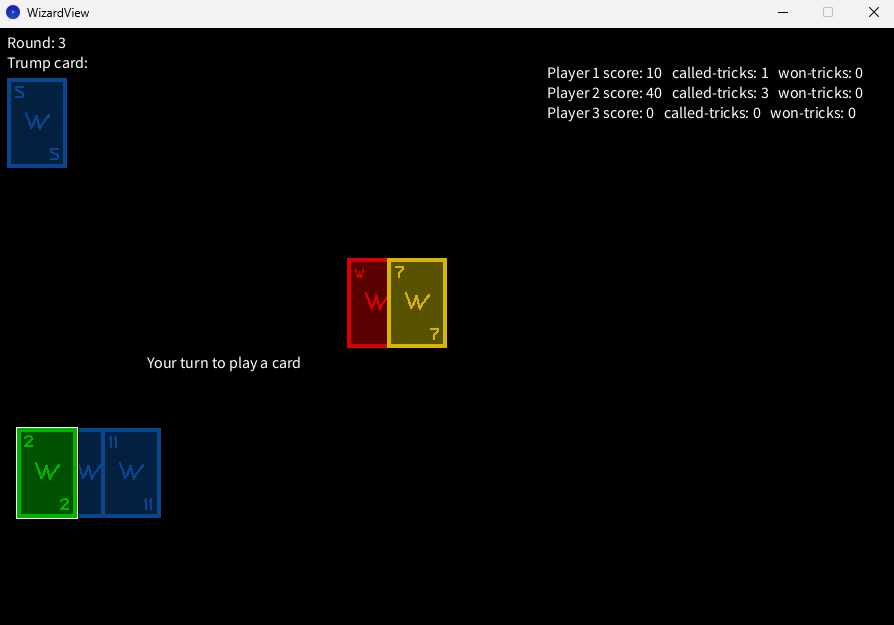

# Wizard

<p>

Wizard ist ein strategisches Stich-/Kartenspiel, bei dem 3 bis 6 Spieler gegeneinander antreten, um ihre Schätz-Künste unter beweis zu stellen.<p>

## Spielprinzip
Das Spielprinzip besteht daraus, dass jede Runde die Rundenanzahl an Karten an jeden Spieler verteilt werden und diese dann schätzen, wie viele Stiche sie mit ihren Karten gewinnen werden. <p>
> Hier muss man nicht alles auf Anhieb verstehen, man kann zweifelsfall einfach im Programm Dinge ausprobieren, um die Regeln zu verstehen.

<p>
Pro Stich wird genau eine Karte pro Spieler im Uhrzeigersinn gelegt und Punkte bekommt man, wenn man genau richtig geraten hat, sonst bekommt man Punkte abgezogen. <p>
<p>
Man gewinnt einen Stich, wenn man die höchste Karte gelegt hat, dabei gibt es einige Dinge zu beachten: <p>
> Ein Zauberer(W) schlägt jede Karte und ein Narr(N) verliert gegen jede Karte. Es gibt eine Trumpf-farbe, Karten dieser Farbe schlagen automatisch Karten mit anderen Farben. <p>
> Sonst gilt wie üblich, dass die höchste Zahl gewinnt.<p>
> Zu beachten ist noch, dass man einen Lege-zwang für eine bestimmte Farbe hat, sofern man keinen Zauberer oder Narr hat. Der Lege-zwang wird durch die vom Startspieler gespielte Karte bestimmt.<p>
> Ein als erstes gelegter Zauberer annuliert diesen Zwang und ein als erstes gelegter Narr verschiebt die Bestimmung auf die nächste gelegte Karte.<p>

Man bekommt für das richtig Raten 20 Punkte und für jeden, dabei gewonnen Stich, 10 Punkte auf seine Punktzahl. <p>
Bei falschem Raten bekommt man für jeden, vom geschätzten Stich abweichenden, Stich 10 Punkte abgezogen. <p>
<p>
Nach dem Stich wird der gewinner des Stiches zum Startspieler.<p>

Eine Runde ist beendet, wenn alle Spieler keine Karten mehr auf der Hand haben. Nach einer Runde ist der Spieler Startspieler, welcher eine Person weiter, im Uhrzeigersinn, vom ersten Startspieler der letzten Runde, ist.<p>
Das Spiel ist vorbei, wenn beim Austeilen der Karten nicht mehr genug vorhanden sind, damit jeder Spieler die Rundenzahl an Karten hat.<p>
Am Ende hat der Spieler mit der höchsten Punktzahl gewonnen.


## Starteinleitung

Zum **Starten** des Spieles müssen folgende Schritte befolgt werden:
>1. Öffnen der Datei `Main.java`
>2. Falls man einem Spiel beitreten will: Eingeben der ip-Adresse eines Servers in die Gänsefüßchen von String ip = "localhost"
>2. Falls man ein Spiel hosten will: "localhost" stehen lassen, ip adresse bestimmen und an andere Spieler weitergeben
>3. Eintragen der gewünschten oder vorgesehenen Spieleranzahl
>4. Ausführen der Methode `main()`

## Verwendete Bibliotheken
Das Programm verwendet die folgenden Bibliotheken:
- [Processing](http://www.processing.org)
- <a href="https://junit.org"> Junit5</a>
- <a href="https://www.sojamo.de/libraries/controlP5/"> ControlP5</a>

## Screenshots
Ein Screenshot des laufenden Spieles:
>

## Jshell Anleitung
Ein sinnvolles Spiel ist nur begrenzt mit der Jshell möglich.
>1. Starten einer Konsole
>2. Öffnen der Jshell über `jshell -R-ea -class-path ./out/production/Wizard"` in einer Kommandozeile
>3. Importieren des Paketes Model über `import Model.*`

`var w = new WizardModel()` Erzeugt ein neues Wizard Spiel.<p>
Über `w = w.BEFEHL` wird der Befehl ausgeführt und das Model aktualisiert, ohne das "=" wird das neue Model nicht gespeichert. <p>
Wenn man mehrere Befehle hintereinander ausführen will, kann man nach jedem Befehl ein .BEFEHL dranhängen:`w = w.BEFEHL1.BEFEHL2`. Dies gilt nicht für die Abfragen, die mit is oder get beginnen <p>
Wenn man den derzeitigen Spielstand sehen will, kann man mit `w` die toString Methode aufrufen.

`addPlayer()` Fügt dem Spiel einen Spieler hinzu.<p>
`dealCards()` Teilt an alle Spiele Karten in Abhängigkeit von der derzeitigen Rundenzahl aus.<p>
`setTricksCalled(ANZAHL, SPIELER)` Setzt eine Stichanzahl für einen Spieler.
`playCard(KARTE)` Spielt eine Karte aus, der ausspielende Spieler ist der, der als nächstes an der Reihe ist. <p>
`isGameOver()` Überprüft, ob das Spiel vorbei ist (nach einer bestimmten Anzahl von Runden).<p>
`endTrick()` Beendet den aktuellen Stich und geht zum nächsten über.<p>
`endRound()` Beendet die aktuelle Runde und geht zur nächsten über.<p>
`getCurrentTrickCaller()` Gibt die Spielernummer zurück, der an der Reihe ist, einen Stich vorherzusagen.<p>
`getCurrentGameWinner()` Ermittelt die derzeitigen Gewinner des Spiels.

### Beispiel-Nutzung:
```
var w = new WizardModel()
w = w.addPlayer().addPlayer().addPlayer().dealCards()
w
w.getCurrentTrickCaller()
w = w.setTricksCalled(0,0).setTricksCalled(1,1).setTricksCalled(1,2)
w
w = w.playCard(w.players().get(0).hand().get(0))
w
w = w.playCard(w.players().get(1).hand().get(0)).playCard(w.players().get(2).hand().get(0))
w = w.endTrick()
w
w = w.endRound()
w
w = w.dealCards()
w.getCurrentTrickCaller()
//usw.

// Absichtliche Fehleingabe, AssertionError erwartet
w = w.setTricksCalled(0,0)
```


